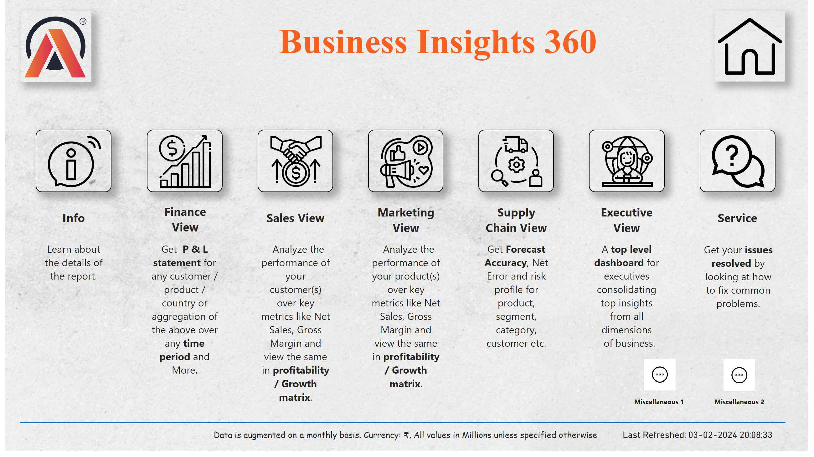

# **Business Insights 360 - AtliQ Hardware**
Live Dashboard: [Click here](https://bit.ly/3uq6bpd)

Presentation: [Click here](https://1drv.ms/p/s!AmeizOqMR1DEhVGQC1TsS_fhIhI8?e=ZKiAdN)

GitHub: [Click here](https://bit.ly/42vuqiC)

- This project expands upon an initial ["Sales & Financial Reporting"](https://github.com/MayurV19/Excel-Projects/tree/main/Sales%20and%20Financial%20Reporting) Excel project by incorporating advanced Power BI features.
- It transforms the project into a sophisticated analytical solution tailored for enterprise-level monitoring of company operations.
- This enhanced version not only facilitates data analysis but also offers insights and visualization capabilities crucial for informed decision-making.
- In essence, it signifies a substantial upgrade, elevating the project to a higher level of purpose and consumption.

## Recap 🔙 

**AtliQ Hardware**, a subsidiary of AtliQ Inc., is a company that sells computer hardware products;  printers, laptops, mouses, monitors, peripherals,accessories, storage devices etc. The company sells its products to customers (retailers and distributors) who then go on to sell them to the end-consumer. It also operates its own exclusive stores, _AtliQ Hardware Exclusive_ (brick & mortar), and _AtliQ Hardware e-store_ (online platform).

As the company continues to grow consistently, there has been an explosion in the volume and velocity of data. The company as such is finding it difficult to operate with as time goes by. As a result, the need for an analytical solution that would aid in company operations and data-driven decision-making is being voiced across the company. The proposed solution is to help the various departments/teams at AtliQ (finance, sales, marketing, supply chain and executive) operate efficiently and effectively.

## Current Project Details ✔

### 🌟 Situation:
AtliQ Hardware, a provider of computer hardware, faced challenges in efficiently managing operations across new markets, particularly in Latin America. With the goal of expanding market share and maximizing profitability, the company recognized the need for a data-driven approach to decision-making and operations.

### 🌟 Task:
The task at hand was to develop an enterprise-level analytical solution that would empower various departments within the company, including Finance, Sales, Marketing, and Supply Chain, to perform their duties seamlessly in an effective manner. This solution should be able to provide comprehensive insights into company financials, market dynamics, product performance, and operational efficiency among other things.

### 🌟 Action:
Leveraging the capabilities of Power BI, I embarked on building a sophisticated analytical platform. This involved utilizing advanced features such as dynamic reporting, advanced DAX queries, advanced analytics (tooltips, bookmarks etc.) and meaningful visualizations to extract and present actionable insights from the company's data.

### 🌟 Result:
The implementation of this analytical solution can potentially result in significant improvements for AtliQ Hardware. With enhanced visibility into key metrics and performance indicators, the company was able to achieve profitability gains and make data-driven decisions to capture market share in both established and emerging markets. The success of this project not only elevated the company's analytical capabilities but also positioned it for sustained growth and success in the competitive landscape of consumer electronics.

**Key Learnings and Implementations:**

- **Project Management:** Utilized Project Charter for effective planning and scoping.
- **Stakeholder Engagement:** Conducted comprehensive Stakeholder Mapping Analysis.
- **Advanced DAX:** Implemented complex DAX queries, formulas, and optimization techniques.
- **Dynamic Reporting:** Leveraged Dynamic Switch using Field parameters.
- **Contextual Understanding:** Gained in-depth understanding of filter, query, and row context.
- **Advanced Analytics:** Incorporated bookmarks, tooltips, and drill-throughs for deeper insights.
- **Meaningful Visualizations:** Used KPIs and informative visuals to enhance data comprehension.
- **Publishing and Management:** Successfully published reports and managed workspaces.
- **Executive Dashboard:** Designed a dedicated dashboard for C-Suite executives.

**Key Terminology:**

- **Sales & Finance:** Gross Sales, Net Invoice Sales, Pre/Post-Invoice Deductions, Net Sales, Total COGS, Gross/Net Margin, Operational Costs, Net Profit, Customer Gap Tolerance.
- **Unit Economics:** Net Sales to Gross Margin conversion, Gross Margin to Net Profit Conversion.
- **Performance Matrix:** GM% vs. Net Sales, NP% vs. Net Sales⚖️.
- **Quality Assurance:** User Acceptance Testing, Minimum Viable Product, Data Validation✅.
- **Supply Chain:** Forecast Accuracy, Net/Absolute Error, Risk❌.
- **Product Channels:** Retailer, Direct, Distributor.
- **Reporting:** Year-to-Date, Year-to-Go➡️.

**BI 360 Challenge tasks:**

- Conditional Formatting to highlight customers not meeting GM % Target: ✅ Implemented in Miscellaneous 1 
- Display top and bottom 5 products for the top 5 markets: ✅ Implemented in Miscellaneous 2 

**Key Features of the Power BI Dashboard:**

- **Home Page:** The home page serves as a seamless navigation hub, ensuring quick access to essential information.
- **Finance View:** P & L table with critical KPIs, interactive charts, and customizable parameters to facilitate a comprehensive financial analysis with respect to time.
- **Sales View:** Gain insights into sales dynamics using performance matrix, product/customer performance data, and donut charts (unit economics).
- **Marketing View:** Analyse performance with respect to product and market, performance matrix, unit economics of gross margin to net profit conversion.
- **Supply Chain View:** Displays crucial supply chain KPIs like forecast accuracy, absolute error, net error, accuracy trend over time, metrics with respect to products.
- **Executive View:** Tailored for executives, providing crucial metrics, revenue contributions, trend charts, and detailed tables.
- **Miscellaneous 1:** Built according to a feature request. Evaluating customer performance in relation to target expectations and actual performance, focusing on Gross Margin %.
- **Miscellaneous 2:** Built according to a feature request. Conducting a thorough analysis of essential metrics, identifying the top 5 and bottom 5 products within the top 5 performing markets.

## **Preview:**

### 1. Home View

  
  
<em> Home View: Landing page of report. Acts as a central hub from where one can navigate to other views. </em>

